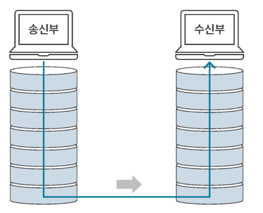
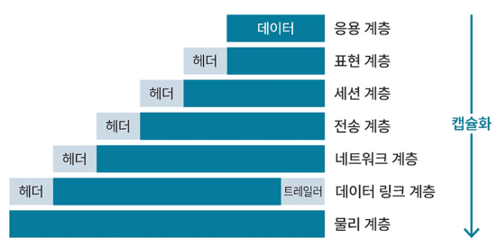
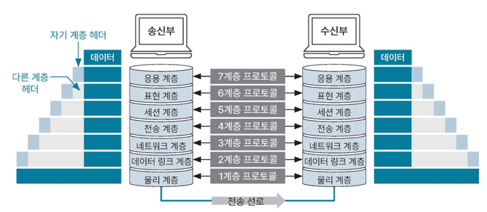

### 네트워크 계층

네트워크는 개념적으로 나눈 OSI7 계층, 실제 인터넷 통신에 사용되는 TCP/IP 4계층과 같은 통신을 위한 약속된 구조가 있다.  

`프로토콜: 데이터를 송수신하기 위해 정한 규칙`

### OSI 7 계층

OSI7계층은 네트워크 통신이 이뤄지는 과정을 7단계로 나눈 네트워크 표준 모델이다.  

- 데이터를 송신할때는 높은 계층에서 낮은 계층으로 전달
- 데이터를 수신할때는 낮은 계층에서 높은 계층으로 전달

각 계층은 독립적이고 데이터를 송신할 때 각 계층에서 필요한 정보를 추가해 데이터를 가공한다.  
이 과정에서 제어 정보를 담은 **헤더**나 **트레일러**가 붙는데, 이 과정을 **데이터 캡슐화**라고 한다.

데이터 캡슐화를 하는 이유는 수신부의 같은 계층에서 **데이터의 호환성을 높이기** 위함이다.

그림에서와 같이 **헤더는 데이터 앞**에 **트레일러는 데이터 뒤**에 붙는다.  
송신부에서 데이터 캡슐화를 거친 결과물을 수신부로 보내면, 수신부는 물리 계층부터 응용 계층까지 거치며 받은 데이터에서 헤더와 트레일러를 분석해 제거하는 **역캡슐화**를 진행한다.

- 7계층(응용 계층): HTTP, FTP 등의 프로토콜을 응용 프로그램의 UI를 통해 제공한다.
- 6계층(표현 계층): 데이터를 표준화된 형식으로 변경한다.
- 5계층(세션 계층): 세션의 유지 및 해제 등 응용 프로그램 간 통신 제어와 동기화를 한다.
- 4계층(전송 계층): 신뢰성 있는 데이터를 전달하기 위한 계층으로 TCP, UDP 같은 전송 방식과 포트 번호 등을 결정한다.
- 3계층(네트워크 계층): 데이터를 송신부에서 수신부까지 보내기 위한 최적 경로를 선택하는 라우팅을 수행한다. 
- 2계층(데이터 링크 계층): 데이터 흐름을 관리하며 데이터의 오류 검출 및 복구 등을 수행한다. (브리지, 스위치, 이더넷)
- 1계층(물리 계층): 데이터를 비트 단위의 0과 1로 변환한 후 장비를 사용해 전송하거나 전기 신호를 데이터로 복원한다. (리피터, 허브)

### TCP/IP 계층

TCP/IP는 **인터넷에서 데이터를 주고받기 위한 네트워크 프로토콜**을 의미한다.  
TCP는 데이터를 나눈 단위인 패킷의 전달 여부와 전송 순서를 보장하는 방식이고, IP는 패킷을 빠르게 보내기 위한 통신 방식을 의미한다.
TCP/IP 기반 프로토콜: HTTP

