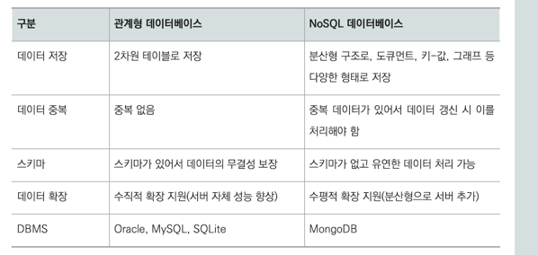

### NoSQL이 무엇인지 관계형 데이터베이스와 비교해 설명해 보세요.

NoSQL은 비관계형 데이터베이스로 2차원 형태의 관계형 데이터베이스보다 유연한 데이터 구조를 가질 수 있습니다.  
그래서 도큐먼트 키-값, 그래프 등 다양한 형태로 데이터를 저장할 수 있습니다. 또한, 서버 증설을 통한 데이터베이스 확장이 가능해서
방대한 양의 데이터를 저장하는 데 유리합니다. 하지만 중복 데이터를 허용하므로 데이터를 갱신하는 경우 관계형 데이터베이스보다 처리 비용이 많이 든다는 단점이 있습니다.  

### 데이터베이스에서 슈퍼 키와 후보 키의 차이점을 설명해 보세요.

슈퍼 키와 후보키 모두 튜플을 식별할 수 있는 유일성을 만족하는 키입니다. 하지만 슈퍼 키는 최소성을 만족하지 않아도 됩니다.  
따라서 슈퍼 키에는 튜플을 식별할 수 없는 속성이 포함될 수 있습니다. 반면에 후보 키는 **최소성**을 만족해야 합니다. 따라서 튜플을 식별하는 데 필요한 속성으로만 구성되어야 합니다.  

### 데이터베이스의 무결성에 관해 설명해보세요.

무결성은 데이터베이스에 **저장된 데이터와 실제 데이터가 일치하는가에 대한 정확성과 데이터의 일관성**을 의미합니다.  
데이터베이스의 무결성으로는 기본 키가 고유한 값을 가져야 한다는 개체 무결성, 속성 값이 도메인에 속해야 한다는 도메인 무결성, 외래 키 값은 참조하는 테이블의 기본 키 값이어야 한다는 참조 무결성이 있습니다.  

### 인덱스가 무엇인가요?

인덱스는 데이터베이스에서 튜플 검색 성능을 향상하기 위해 속성 값과 튜플이 저장된 주소를 인덱스 테이블에 저장하는 방식입니다.  
인덱스 테이블은 정렬된 상태를 유지하므로 데이터베이스로 튜플을 검색하는 것보다 검색 속도가 빠르다는 장점이 있습니다.  
하지만 데이터의 추가, 수정, 삭제 시 **정렬 과정이 필요**해 속도가 느린 단점이 있습니다.

### ORM을 사용해 본 경험이 있는지, 있다면 왜 ORM을 사용했는지 설명해 주세요.

ORM은 객체와 관계형 데이터베이스 사이의 패러다임 불일치를 해결하여 **객체 중심의 개발을 가능하게 하기 위해 사용**합니다. 또한 **반복적인 JDBC 및 매핑 코드를 줄여 생산성을 높이고**,
**엔티티 중심으로 관리하여 유지보수성을 향상**시킬 수 있다는 장점이 있습니다.

### 데이터베이스의 트랜잭션 수행 과정 중 오류가 발생한다면 어떻게 처리해야 할까요?

데이터베이스에서 트랜잭션 수행 과정 중 오류가 발생하면 **ROLLBACK**을 통해 트랜잭션을 수행하기 전 상태로 데이터베이스를 원복해야 합니다. 
이렇게 처리하는 이유는 트랜잭션 수행 결과가 데이터베이스에 완전히 반영되거나 아예 반영되지 않아야 하기 때문입니다.  

### 데이터베이스에서 락은 무엇인가요?

락은 트랜잭션이 처리되는 순서를 보장해 무결성을 유지하는 방법입니다. 락에는 공유락과 베타락이 있습니다. 공유 락은 데이터를 읽기 위한 락으로, 데이터가 변경되지 않습니다.  
따라서 특정 트랜잭션을 수행 중일 때 **공유 락을 가진 다른 트랜잭션이 동시에 접근**할 수 있습니다. 반면에 베타 락은 데이터를 수정하는 락으로 하나의 트랜잭션을 수행 중일 때 다른 트랜잭션이 접근할 수 없습니다.  
이와 같이 락을 이용할 때 트랜잭션이 교착 상태에 빠질 수 있습니다. 

tip) 락의 목적은 데이터베이스의 무결성을 유지하는 것이다.

### 데이터베이스의 교착 상태를 설명해 보세요.

데이터베이스의 교착 상태는 하나의 트랜잭션이 처리 중인 데이터에 대해 락을 가지고 있는 상태에서 다른 트랜잭션이 처리 중인 데이터에 대해 락을 요청하면서 무한 대기 상태에 빠지는 현상입니다.
교착 상태를 해결하는 방법으로는 예방 기법과 회피 기법이 있습니다. 예방 기법은 트랜잭션을 수행하기 전에 미리 락을 획득하는 방식이고, 회피 기법은 **트랜잭션이 들어온 순서에 따라 락을 획득하거나 트랜잭션을 종료**하는 방식입니다.

### 데이터베이스의 이상 현상이란 무엇이며 어떻게 해결할 수 있나요?

이상 현상이란 트랜잭션을 처리하는 중 발생하는 문제로 **속성 간 종속**이나 **데이터의 중복**으로 발생합니다.  
삽입 이상, 갱신 이상, 삭제 이상이 있으며, 속성 간 종속을 해제하고 데이터베이스의 중복을 제거하기 위해 테이블을 분해하는 **데이터베이스 정규화**를 진행하게 됩니다. 

`갱신 이상: 속성 간 종속으로 데이터를 수정할 경우 데이터 일관성이 깨짐`

`삭제 이상: 속성 간 종속으로 데이터를 삭제할 경우 원하지 않는 데이터까지 삭제`

`삽입 이상: 불필요한 데이터 없이는 원하는 데이터를 추가할 수 없는 현상`

이상 문제는 한 테이블에 관련 없는 정보까지 너무 많아서 데이터가 중복되는 문제이다.

### 인덱스를 사용 중일 때 데이터를 삭제하면 발생할 수 있는 문제는 무엇일까요?

데이터 삭제가 잦을 경우 저장 공간을 낭비할 수 있다는 문제점이 있습니다. 인덱스는 데이터베이스의 검색 효율을 높이기 위해 인덱스 테이블을 사용합니다.  
삭제 연산이 일어나면 데이터베이스에는 해당 튜플이 삭제 되지만, **인덱스 테이블에서는 해당 튜플을 '사용하지 않음'으로 처리하고 실제로 데이터는 삭제하지 않습니다.**  
그래서 잦은 데이터 삭제가 일어나면 인덱스 테이블에 불필요한 데이터가 남아 저장 공간을 낭비하게 됩니다.  

### 인덱스를 구현하는 방식에는 무엇이 있나요?

인덱스를 구현하는 방식으로는 해시 테이블을 사용하는 방식과 B+- 트리를 이용하는 방식이 있습니다.  
해시 테이블은 해시 함수를 사용해 데이터의 검색 성능을 높이지만, 등호 연산만 가능해서 **속성 범위로 데이터를 검색할 수 없다는 단점**이 있습니다.
반면에 **B+- 트리는 트리 구조로 인덱스 테이블을 구성하며, 데이터를 범위로 검색할 수 있어서 시간 면에서 효율적**입니다.

### 데이터베이스의 조인 연산 중 INNER JOIN과 OUTER JOIN의 차이점은 무엇인가요?

INNER JOIN은 내부 조인으로 여러 테이블에서 기준이 되는 열의 데이터 중 **공통 되는 튜플에 대해서만 조회하는 연산**입니다.  
이는 **여러 집합에서 교집합을 찾는 것과 동일**합니다.  반면에 OUTER JOIN은 외부 조인으로, 기준이 되는 테이블에 따라 왼쪽 외부 조인, 오른쪽 외부 조인, 완전 외부 조인으로 나뉩니다.  
연산 결과는 기준이 되는 테이블의 데이터를 모두 포함하며, 나머지 테이블에서 매칭되는 데이터가 없을때 NULL 값으로 나타납니다.  
