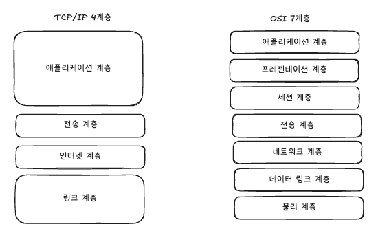
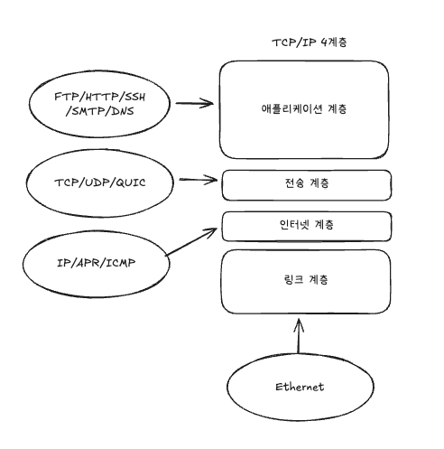

### 계층 구조

- TCP/IP는 4개의 계층 구조를 갖는다.
- 링크, 인터넷, 전송, 애플리케이션 계층
- OSI 계층은 애플리케이션 계층을 3개로, 링크 계층을 데이터 링크, 물리 계층으로 나눠서 표현
- 특정 계층이 변경되었을 때 다른 계층이 영향을 받지 않도록 설계됨
- TCP를 UDP로 변경해도 인터넷 웹 브라우저를 다시 설치하지 않아도 됨

### 애플리케이션 계층

- FTP, HTTP, SSH, SMTP, DNS 응용 프로그램이 사용되는 프로토콜 계층
- 웹 서비스, 이메일과 같은 서비스를 제공하는 계층

### 전송 계층

- 송신자와 수신자를 연결하는 통신 서비스를 제공
- 연결 지향 데이터 스트림 지원, 신뢰성, 흐름 제어 제공
- 애플리케이션과 인터넷 계층 사이의 데이터가 전달될 때 중계 역할을 한다.
- TCP, UDP

### TCP

- 패킷 사이의 순서 보장
- 연결지향 프로토콜 사용해서 연결을 하여 신뢰성을 구축하여 수신 여부 확인
- 가상회선 패킷 방식 사용

### UDP

- 순서를 보장하지 않음
- 데이터그램 패킷 교환 방식

### 가상회선 패킷 교환 방식

- 각 패킷에 **가상회선 식별자**가 포함되며 모든 패킷을 전송하면 가상회선 해제, 패킷은 전송된 순서대로 도착하는 방식

### 데이터그램 패킷 교환 방식

- 패킷이 **독립적으로 이동**하며 **최적의 경로**를 선택
- 하나의 메시지에서 분할된 여러 패킷은 서로 다른 경로로 전송 가능
- **도착한 순서**가 다를 수 있음

### TCP 연결 성립 과정

- 3-way handshake라는 작업을 진행
- SYN → SYN + ACK → ACK
- SYN 단계: 클라이언트가 서버에서 ISN을 담아 SYN을 보냄
- ISN은 새로운 TCP 연결의 첫 번째 패킷에 할당된 임의의 시퀀스 번호를 말함
- SYN + ACK 단계: 서버는 클라이언트의 SYN을 수신하고 서버의 ISN을 보내며 승인번호로 클라이언트의 ISN + 1 보냄
- ACK 단계: 클라이너트는 서버의 ISN + 1한 값인 승인번호를 담아 ACK를 서버에 보냄
- 3-way handshake 과정 이후 신뢰성이 구축되어 데이터 전송을 시작함
- UDP는 이러한 과정이 없기 때문에 신뢰성이 없는 계층이라 불림

`SYN : Synchronization의 약자, 연결 요청 플래그`  
`ACK : Acknowledgement의 약자, 응답 플래그`  
`ISN : Initial Sequence Number의 약어, 초기 네트워크 연결을 할때 할당된 32비트 고유 시퀀스 번호`  

