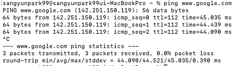
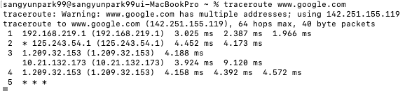

### 네트워크 병목 현상의 주된 원인

- 네트워크 대역폭
- 네트워크 토폴리지
- 서버 CPU, 메모리 사용량
- 비효율적인 네트워크 구성

### ping

- 네트워크 상태를 확인하려는 대상 노드를 향해 일정 크기의 패킷을 전송하는 명령어
- 패킷 수신 상태, 도달하기까지 시간, 네트워크가 잘 연결되어 있는지 확인
- TCP/IP 중 ICMP 프로토콜을 통해 동작
- ping [IP 주소 or 도메인 주소]

### netstat

- 접속되어 있는 서비스들의 네트워크 상태를 표시
- 네트워크 접속, 라우팅 테이블, 네트워크 프로토콜 보여줌
- 주로 서비스의 포트가 열려 있는지 확인할 때 사용

### nslookup

- DNS에 관련된 내용을 확인하기 위해 사용하는 명령어
- 특정 도메인에 매핑된 IP 확인

### tracert

- 리눅스에선 traceroute
- 목적지 노드까지 네트워크 경로를 확인할 때 사용하는 명령어
- 목적지 노드까지 구간들 중 어느 구간에서 응답 시간이 느려지는지 등을 확인

### 기타
- ftp를 통해 대형 파일 전송 테스팅 가능
- tcpdump를 통해 노드로 오고가는 패킷을 캡쳐 가능
- 네트워크 분석 프로그램, wireshark, netmon

