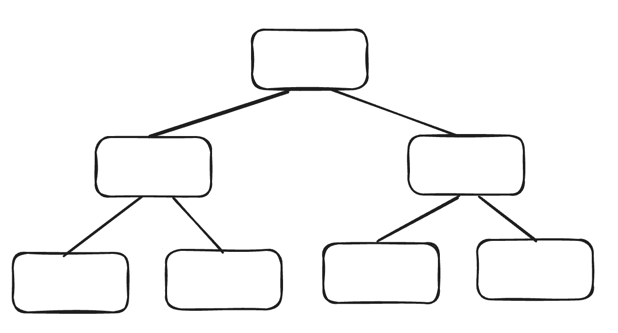
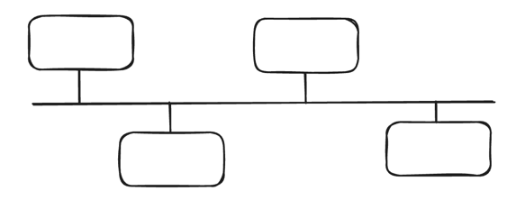
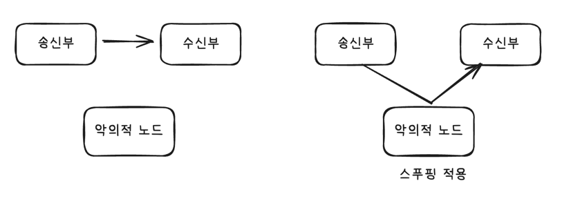
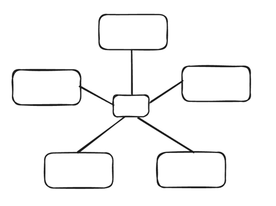
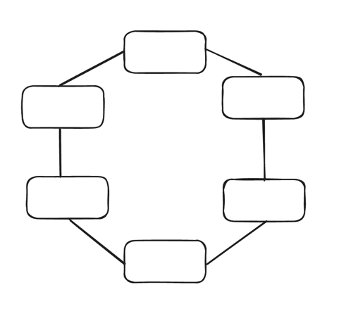
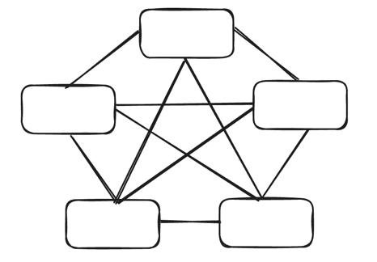

### 네트워크 토폴로지
- **노드와 링크가 어떻게 배치되어 있는가**에 대한 방식 및 연결 형태

### 트리 토폴로지
- 계층형 토폴로지, 트리형태 배치
- 노드 추가, 삭제 용이
- 특정 노드에 트래픽 집중시 하위 노드에 영향 끼침

### 버스 토폴로지
- **중앙 통신 회선 하나에 여러 개의 노드가 연결**
- LAN(근거리 통신망)에서 사용
- 설치 비용 저렴, 신뢰성 우수, 중앙 통신 회선에 노드 추가,삭제 용이
- 스푸핑 발생 가능성 존재

### 스푸핑
- LAN에서 송신부의 패킷을 송신과 관련없는 다른 호스트에 가지 않도록 하는 스위칭 기능 마비 및 속임수로 특정 노드에 패킷이 오도록 하는 것

### 스타 토폴로지
- 중앙에 있는 노드에 모두 연결
- 노드 추가 및 에러 탐지 용이, 패킷 충돌 발생 가능성 적음
- 중앙 노드에 장에가 발생할 경우 전체 네트워크 사용 불가

### 링형 토폴로지
- 각각의 노드가 양 옆의 두 노드와 연결, 고리모양
- 하나의 연속된 길을 통해 통신하는 망 구성 방식
- 노드에서 노드로 데이터 이동
- 노드 수 증가되어도 네트워크상의 손실 없고 충돌 발생 가능성 적고 노드의 고장 쉽게 찾음
- 네트워크 구성 변경 어려움, 회선에 장애 발생시 전체 네트워크 영향

### 메시 토폴리지
- 망형 토폴리지, 그물망 처럼 연결된 구조
- 한 단말 장치 장애 발생시 여러 경로 존재로 인해 네트워크 계속 사용 가능
- 트래픽 분산 처리 가능
- 노드의 추가가 어렵고 구축 비용, 운용 비용이 고가

### 병목 현상
- 전체 시스템의 성능이나 용량이 하나의 구성 요소로 인해 제한을 받는 현상 
- ex) 병의 몸통보다 병의 목 부분 내부 지름이 좁아서 물이 상대적으로 천천히 쏟아지는 것
- 토폴리지는 병목 현상을 찾을 때 중요한 기준이 된다.
- 네트워크가 어떤 토폴리지를 갖는지, 어떠한 경로로 이루어져 있는지 알아야 병목 현상을 해결할 수 있다.