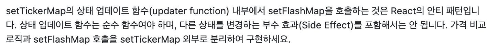
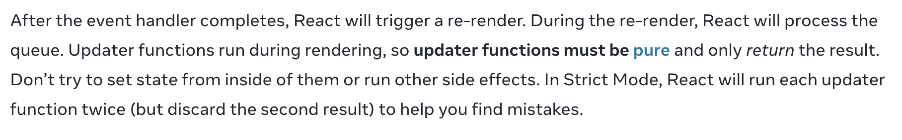

## 들어가며



Upbit WebSocket API를 활용하여 현재가, 전일 대비, 거래대금 데이터를 실시간으로 업데이트하는 기능을 구현하고 PR을 날린 후gemini-code-assist에게 코드 리뷰로 받은 멘트입니다.  


리뷰를 받은 코드는 아래와 같습니다.  

```javascript
const handleTickerMessage = useCallback((data: any) => {
        setTickerMap((prev) => {
            const prevPrice = prevPriceRef.current[data.code];
            const nextPrice = data.trade_price;

            const next = {
                ...prev,
                [data.code]: {
                    market: data.code,
                    trade_price: nextPrice,
                    signed_change_rate: data.signed_change_rate,
                    acc_trade_price_24h: data.acc_trade_price_24h,
                },
            };

            if (prevPrice !== undefined && prevPrice !== nextPrice) {
                setFlashMap((prevFlash) => ({
                    ...prevFlash,
                    [data.code]: Date.now(),
                }));
            }

            prevPriceRef.current[data.code] = nextPrice;
            return next;
        });
    }, []);
```

## 왜 안티 패턴일까?

React 공식 문서에 작성된 내용은 아래와 같습니다.



이벤트 핸들러가 모두 실행된 후, React는 다시 렌더링을 수행합니다. 다시 렌더링하는 동안 React는 state 업데이트 queue를 처리합니다. updater function은 렌더링 과정 중 실행되기 때문에 반드시 순수 함수여야 하며 결과만 반환해야 합니다. updater function 내부에서 다른 state를 변경하거나 다른 부수 효과를 실행하려고 하지 마세요.


## 왜 updater function은 순수 함수여야 할까?

예시를 위해 React 실험용 프로젝트에서 아래와 같은 코드를 작성했습니다.

```javascript
function UpdaterFunctionPure() {

    const [count, setCount] = useState(0);
    const [logCount, setLogCount] = useState(0);

    const handleBadClick = () => {
        setCount((prev) => {
           setLogCount((log) => log + 1);
            console.log("setLogCount 호출");
           return prev + 1;
        });
    }

    const handleGoodClick = () => {;
        setCount((prev) => prev + 1);
        setLogCount((log) => log + 1);
    }

    return (
        <div>
            <h1>Updater Function Pure Test</h1>
            <p>count: {count}</p>
            <p>logCount: {logCount}</p>

            <button onClick={handleBadClick}>
                Bad: updater 안에서 setState
            </button>
            <button onClick={handleGoodClick}>
                Good: updater 밖에서 setState
            </button>
        </div>
    );
}
```
handleBadClick은 setCount의 updater function 내부에서 setLogCount를 호출하고 있습니다. 즉, updater function 내부에서 다른 state값을 변경하는 side effect를 포함하고 있습니다.

handleGoodClick은 updater function 내부에서는 count 계산만 수행하고, setLogCount는 updater function 외부에서 호출합니다.

## 각각 동작하는 방식

### handleBadClick

