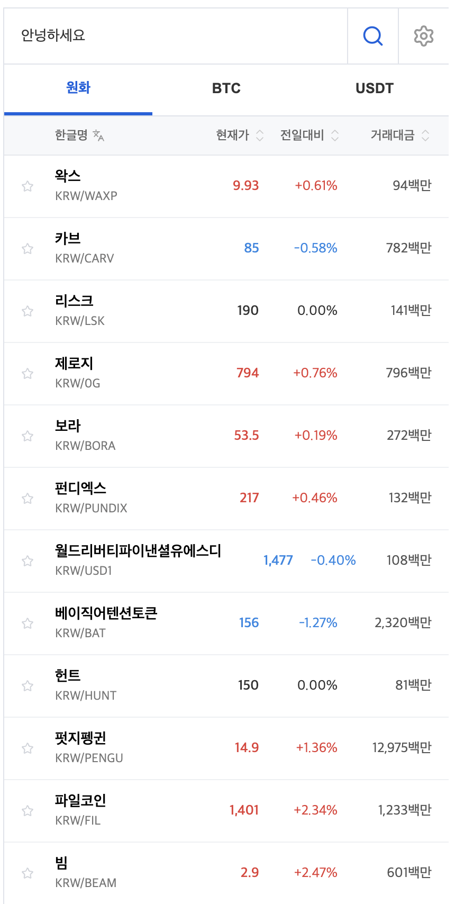
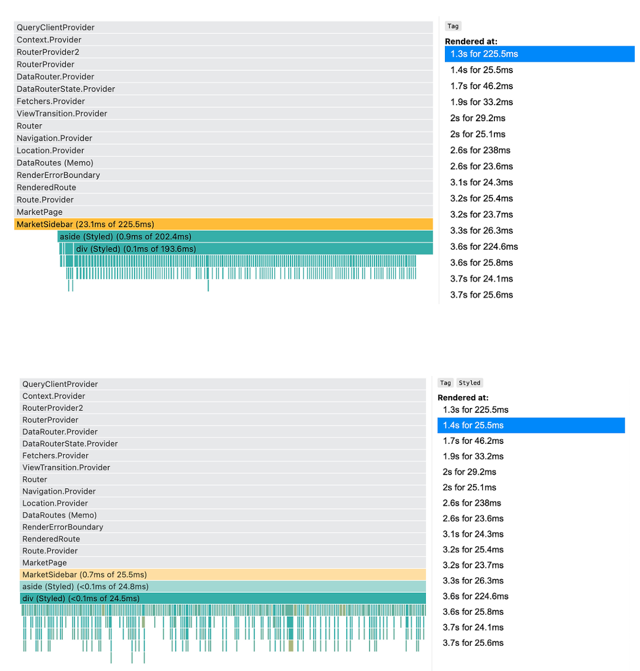
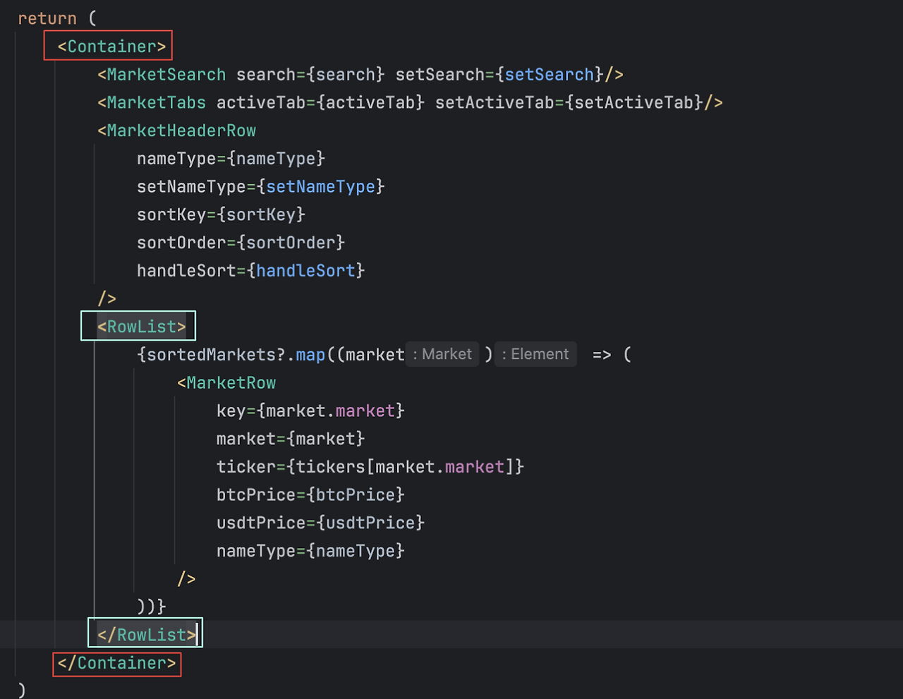
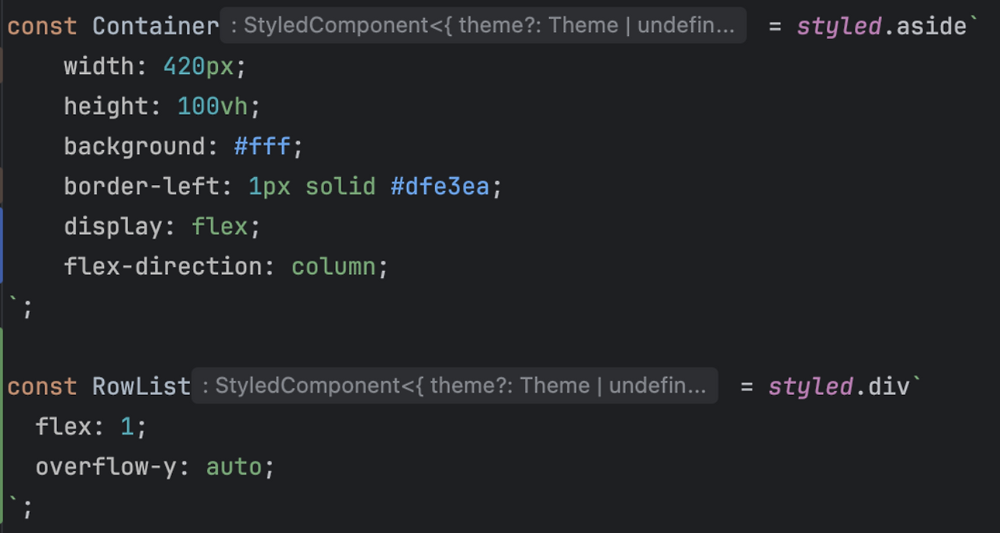
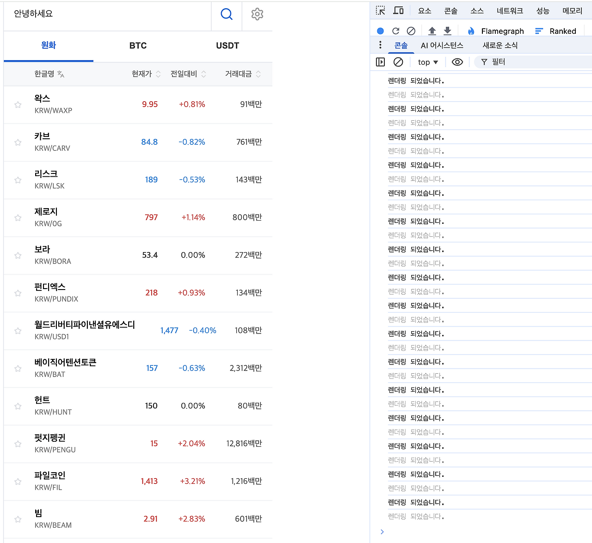
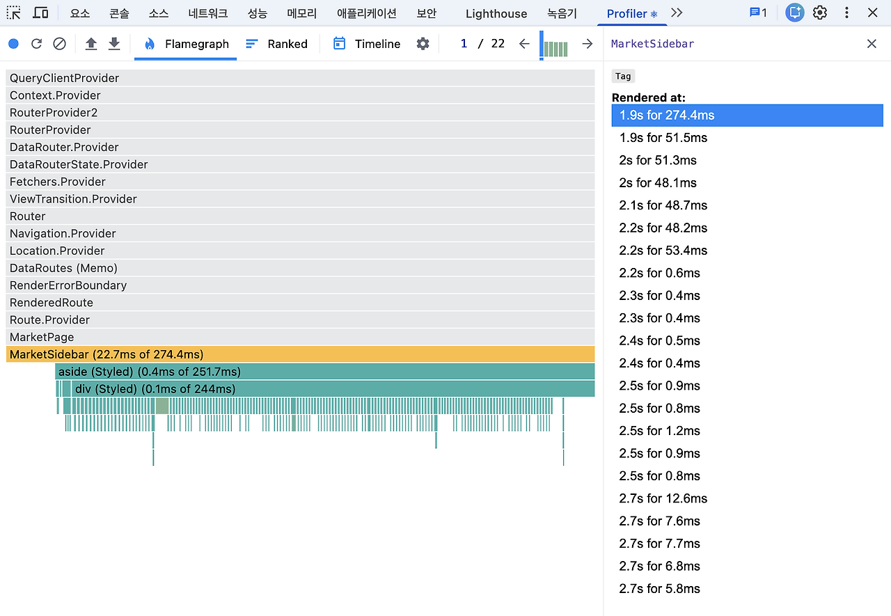
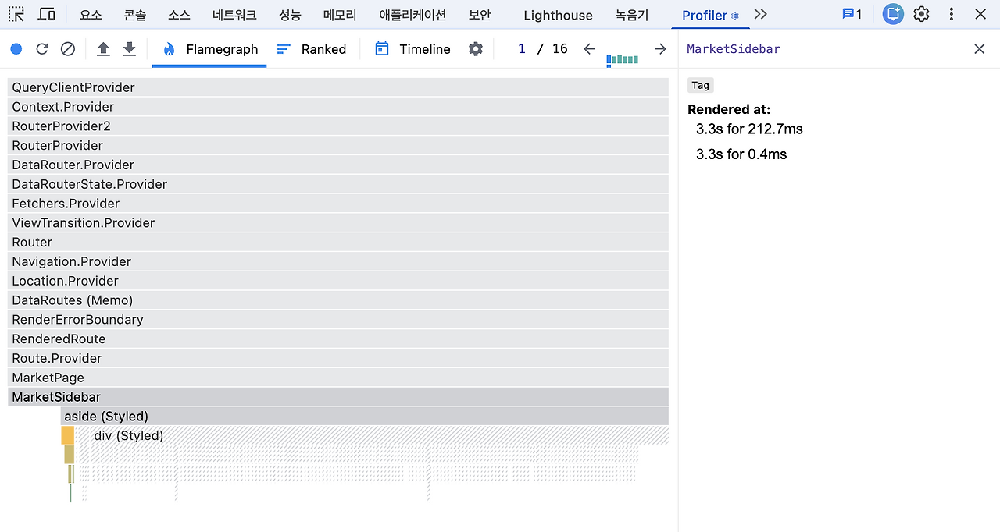

## 들어가며

  

 
해당 UI에서 코인명과 심볼명으로 검색을 해주는 기능에서 텍스트를 입력할때 입력창 동기화가 지연되는 문제가 발생했습니다.
문제의 원인을 파악하기 위해서  검색란에 "안녕하세요"를 입력하는 상황으로 프로파일링을 진행했습니다.

## 문제 원인 분석

   

 
React Dev tools의 Profiler를 활용해서 동일한 상황을 프로파일링한 결과 15번 렌더링이 반복되었습니다. 또한, 첫 렌더링(React Query)를 제외하고 중간 중간 200ms가 넘는 렌더링도 존재합니다.
수치를 보면, div태그의 자식 컴포넌트가 렌더링 시 대부분의 시간을 사용하고 있습니다. 

   

    

 
div 태그는 styled component로 정의한 RowList를 의미합니다. Profiler 결과를 보면 RowList 자체의 렌더링 비용은 매우 작았지만, 자식 컴포넌트를 포함한 전체 렌더링 시간은 훨씬 크게 나타났습니다.  

즉, 성능 비용의 대부분은 RowList 자체가 아니라 그 내부에 렌더링되는 코인 목록인 MarketRow 컴포넌트에서 발생하고 있음을 확인할 수 있었습니다.

    

 
로깅을 통해 확인해본 결과, 검색어를 입력할 때마다 MarketRow 컴포넌트가 반복적으로 렌더링되는 것을 확인할 수 있었습니다.
해당 문제는 검색어 state 변경으로 인해 부모 컴포넌트가 리렌더링되고 그 결과 코인 목록 전체 MarketRow가  리렌더링되면서 발생했습니다.

참고로 React Query를 사용해 업비트 API 데이터를 조회하고 있었기 때문에, 해당 데이터는 캐싱되어 입력 시마다 API가 재요청되지는 않았습니다.

## 문제 해결

### useDeferredValue
검색창에 값을 입력할때마다 렌더링 부담을 줄이기 위해서 검색어 입력 자체는 즉시 반영하되, useDeferredValue를 사용해서 MarketRow 렌더링은 지연시키도록 했습니다.

    

 
시간적인 측면에서 useDeferredValue를 사용하기 전에 보였던 200ms 이상의 시간들 보다는 적게 걸렸지만, 여전히 RowList 내부의 MarketRow들이 많이 리렌더링 되었습니다. useDeferredValue는 리스트 업데이트의 우선순위를 낮춰줄 뿐, 검색어 상태 변경으로 인한 부모 컴포넌트의 리렌더링 횟수를 줄이지는 못했습니다.

[useDeferredValue란?]( https://ko.react.dev/reference/react/useDeferredValue)

### Debounce
**검색어 입력이 일정 시간 동안 멈춘 경우에만 필터링을 수행하도록 debounce를 적용**했습니다. 이를 통해 입력 시마다 발생하던 리스트 전체 렌더링을 방지하고, 입력 시마다 발생하던 렌더링을 입력이 멈춘 경우에만 발생하도록 줄일 수 있었습니다.

    

 
useDeferredValue보다 Debounce방식을 사용할 때, UI적으로나 렌더링 횟수 측면에서 더 좋은 성능을 내는 것을 확인했습니다.

## 정리
이번 문제는 검색어 state의 변경으로 인해 코인 목록 전체가 반복적으로 리렌더링 됨으로 인해 발생하는 성능 문제였습니다.

useDeferredValue는 무거운 리스트 업데이트의 우선순위를 낮추는 데 도움이 되었지만 부모 컴포넌트의 state 변경으로 인한 렌더링 횟수 자체는 줄여주지 못했습니다. debounce를 적용한 이후에는 무거운 리스트 렌더링이 입력 시마다 발생하지 않고, 입력이 멈춘 뒤 1회만 수행되도록 개선되었습니다.

그 결과 렌더링 횟수는 15회에서 1회로 감소했으며, 불필요한 렌더링이 제거되면서 input 입력 지연 문제도 함께 개선되었습니다. 특히 Profiler 상에서는 기존에 약 200ms 이상 소요되던 렌더링이 반복적으로 발생했던 반면, debounce 적용 이후에는 해당 렌더링이 거의 발생하지 않는 것을 확인할 수 있었습니다.

