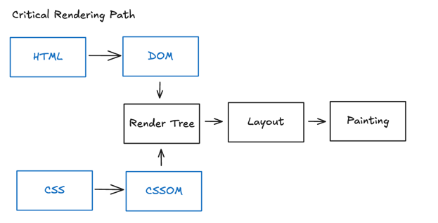
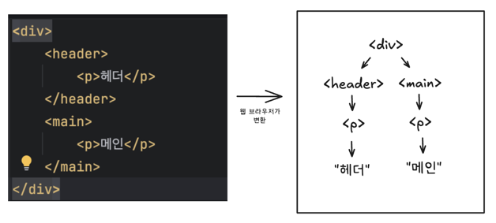
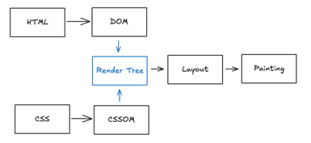
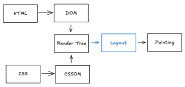
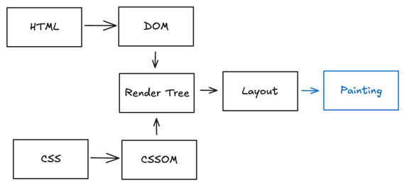

## 브라우저가 페이지를 화면에 렌더링 하는 방법

### 1단계 - Critical Rendering Path

- HTML과 CSS코드를 DOM과 CSSOM로 변환

### DOM
DOM(Document Object Model)은 문서 객체 모델로 HTML을 브라우저가 해석하기 편한 방식으로 변환한 **객체 트리**

### 2단계 - Render Tree
   

- Render 트리는 웹 페이지의 "청사진"

### 3단계 - Layout

- Render Tree를 기반으로 실제 웹 페이지에 요소들의 배치를 결정하는 작업

### 4단계 - Painting

- 요소들을 화면에 그려내는 과정

