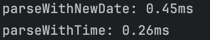

## 들어가며
```javascript
time: Math.floor(
                new Date(`${candle.candle_date_time_utc}Z`).getTime() / 1000 +
                KST_OFFSET_SECONDS
            ) as Time
```
- Coin 프로젝트의 CoinCandleChart.tsx 파일에서 해당 코드는 매번 차트에 그리기 위한 데이터로 변경할 때마다 호출되는 함수이다.
- 날짜 문자열을 new Date()로 파싱한 후, 타임스탬프를 변환하는 방식보다 기존에 제공되는 타임 스탬프를 변환하는 것이 훨씬 더 효율적이라는 피드백을 받았다.

## 실험
- 실제로 정말 어느정도의 효과가 존재하는지 알아보기 위해 실험을 진행했다.
```javascript
const SAMPLE_SIZE = 1000;
const LOOP = 10000;

const candles = Array.from({SAMPLE_SIZE}, (_, i) => ({
    candle_date_time_utc: "2025-07-01T12:00:00",
    timestamp: 1751371200000 + i * 60_000,
}));

function parseWithData() {
    return candles.map((candle) => ({
        time: Math.floor(new Data(`${candle.candle_date_time_utc}Z`).getTime() / 1000),
    }));
}

function parseWithTime() {
    return candles.map((candle) => ({
        time: Math.floor(candle.timestamp / 1000)
    }));
}

function measure(label, fn) {
    const start = performance.now();

    for (let i = 0; i < LOOP; i++) {
        fn();
    }

    const end = performance.now();

    console.log(`${label}: ${(end - start).toFixed(2)}ms`);
}

measure("parseWithNewDate", parseWithData);
measure("parseWithTime", parseWithTime);
```
- 1000개의 캔들 데이터를 변환하는 함수를 10000번 반복 실행하는 실험이다.

### 실험 결과


- 제공된 timestamp를 사용하는 것이 new Date()를 사용하는 방식보다 약 2배 빨랐다.