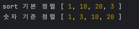

코드
```javascript
const arr = [1,20,10,3];

console.log("sort 기본 정렬", [...arr].sort());
console.log("숫자 기준 정렬", [...arr].sort((a,b) => a - b));
```


결과



- 단순 sort() 메서드는 배열 객체 내의 원소들을 문자열로 변경한 뒤, 사전순으로 값을 비교하게 됩니다.
- "10"과 "3"을 비교할 경우 맨 앞자리인 "1"과 "3"을 먼저 비교하므로 "3"이 더 큰 결과로 나옵니다.
- 숫자 기준 정렬을 하기 위해선 sort() 메서드 내부에 비교 함수를 전달해야 합니다.
- `(a, b) => a - b`를 사용할 경우 숫자의 크기를 기준으로 오름차순 정렬됩니다.