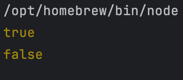

### 전개 연산자 사용시 새 배열을 생성하는가?

코드
```javascript
let a = [1,2,3];

let result1 = a;
let result2 = [...a];

console.log(a === result1); 
console.log(a === result2);
```


결과  


- a === result2의 값이 false로 나왔으므로 result1인 a 배열의 객체와 result2인 `[...a]` 배열의 객체가 다른 것을 알 수 있습니다.
- 전개 연산자를 사용하면 새로운 배열 객체가 생성됩니다.